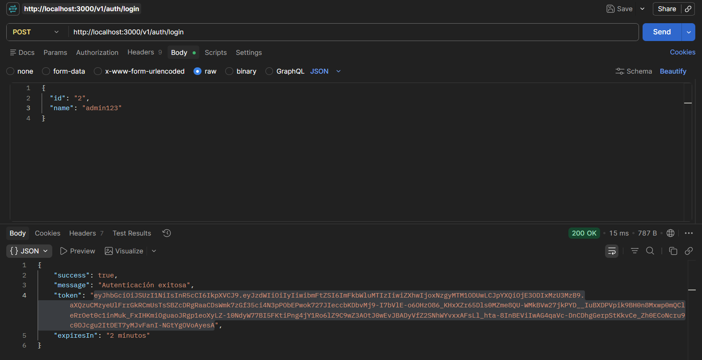
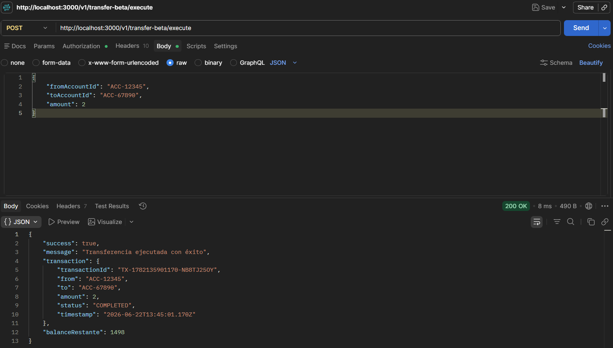
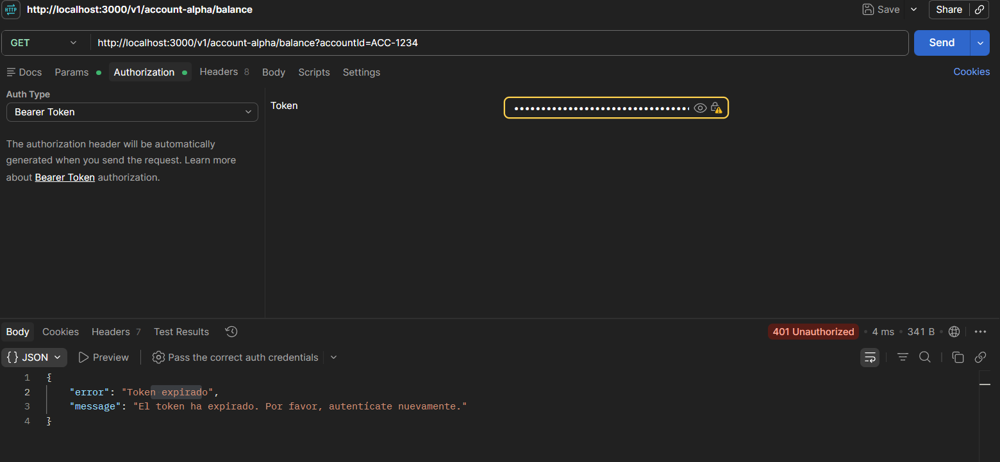
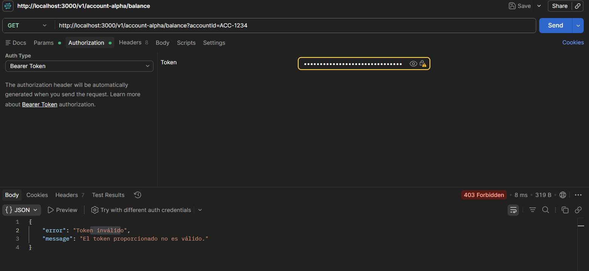

# Fintech SecurePay - Evaluación Parcial Práctica: Arquitecturas Distribuidas

### Evidencia de Postman

#### 1. Generación de Token JWT

- Endpoint: POST `/v1/auth/login` (simulado)
- Response: Token JWT firmado con RS256
- Payload decodificado mostrando claims (sub, name, exp)

#### 2. Acceso con Token Válido

- Endpoint: POST `/v1/transfer-beta/execute`
- Header: `Authorization: Bearer <token_valido>`
- Response: 200 OK - Transferencia ejecutada exitosamente

#### 3. Acceso con Token Expirado

- Endpoint: POST `/v1/transfer-beta/execute`
- Header: `Authorization: Bearer <token_expirado>`
- Response: 401 Unauthorized - "Token expirado"

#### 4. Acceso con Token Inválido

- Endpoint: POST `/v1/transfer-beta/execute`
- Header: `Authorization: Bearer <token_invalido>`
- Response: 403 Forbidden - "Token inválido"

---
